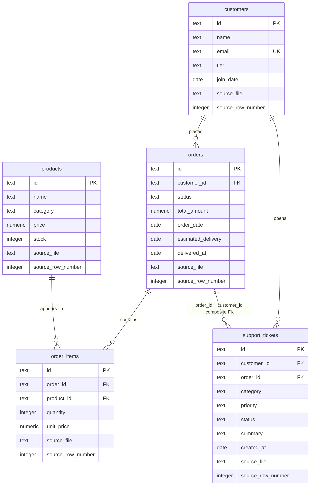
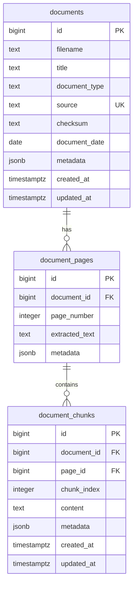
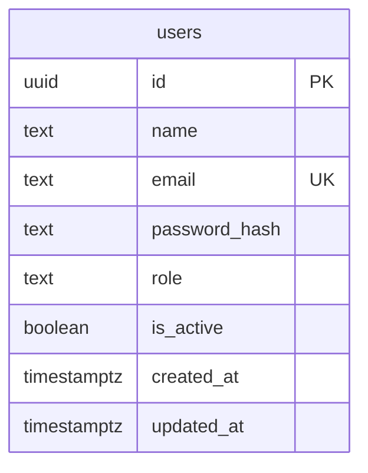

# Entity Relationship Diagram

The diagrams separate business-domain data, document/RAG-preparation data, and application authentication. No relationship from `users` to `customers` is represented: application accounts and imported business customers are distinct entities.

### Structured Domain

### Document and RAG Preparation

### Application Authentication

Notes:

- `ORDERS` has a unique (`id`, `customer_id`) key so `SUPPORT_TICKETS` can enforce that the ticket's order belongs to its customer.
- `document_chunks` references (`page_id`, `document_id`) together, ensuring a chunk's page belongs to the same document.
- `document_pages` is optional when a document is first recorded; the schema permits document metadata to be created before page inventory is available.
- `customers.email` is unique case-insensitively through an expression index on `lower(email)`.
- The domain and document diagrams are separate because no CSV-to-PDF entity relationship is supported by the source content.
- `users` is an application-authentication entity, not a customer record; it has no relationship to `customers`.
- `users.email` is stored trimmed and lowercase and is also protected by a case-insensitive unique expression index.
